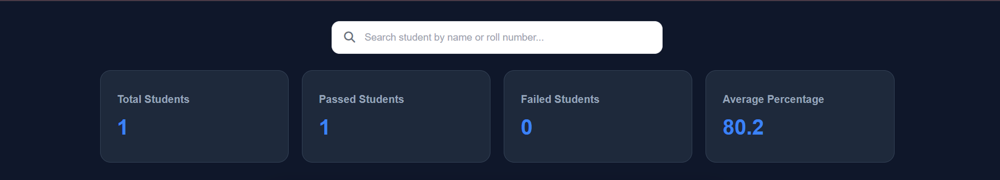
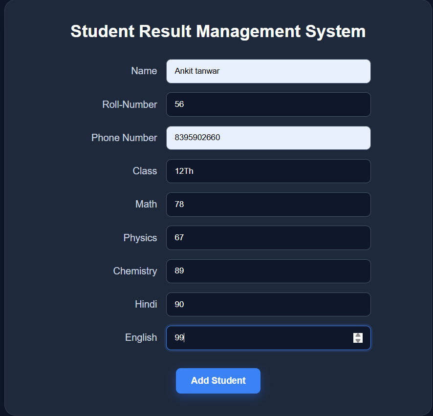
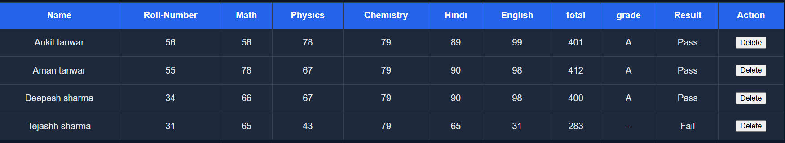

# 🎓 Student Result Management System

A **Student Result Management System** built using **HTML, CSS, and JavaScript** to manage student records, calculate results, and display performance in a clean and user-friendly dashboard.

This project was created to practice **JavaScript DOM manipulation, arrays, objects, functions, localStorage, events, filtering, and dynamic table rendering**.

## 🌐 Live Demo

**Live Demo:** (https://tanwar-ankit.github.io/student-result-management-system/)

## 🚀 Features

* ➕ Add new students
* 🔢 Roll number validation
* 🚫 Duplicate roll number prevention
* 📚 Store student marks for 5 subjects
* 🧮 Automatically calculate total marks
* 📊 Automatically calculate percentage
* 🏆 Automatic grade calculation
* ✅ Pass / ❌ Fail result calculation
* 🔍 Search students by name or roll number
* 🗑️ Delete students
* 💾 Store data using Local Storage
* 📈 Dashboard with:

  * Total students
  * Passed students
  * Failed students
  * Average percentage
* 🔄 Data remains available after page refresh

## 🛠️ Technologies Used

* **HTML5**
* **CSS3**
* **JavaScript**
* **Local Storage**
* **Font Awesome**

## 📂 Project Structure

```text
student-result-management-system/
│
├── index.html
├── style.css
├── script.js
└── README.md
```

## 📊 Result Calculation

The system calculates:

**Total Marks**

```text
Math + Physics + Chemistry + Hindi + English
```

**Percentage**

```text
Total Marks / 5
```

### Grade System

| Percentage | Grade |
| ---------- | ----- |
| 90–100     | A+    |
| 80–89      | A     |
| 70–79      | B+    |
| 60–69      | B     |
| 50–59      | C     |
| 40–49      | D     |
| 33–39      | E     |
| Below 33   | Fail  |

A student is marked **Fail** if any subject has marks below 33.

## 🔍 Student Search

Students can be searched using:

* Student name
* Roll number

The search supports partial matching. For example, searching `ank` can find **Ankit**.

## 💾 Data Storage

Student records are stored in the browser's **Local Storage**, so the data remains available even after refreshing the page.

> Note: Local Storage is used for learning purposes. A production application would use a backend database such as MongoDB.

## 🎯 Learning Goals

Through this project, I practiced:

* JavaScript DOM manipulation
* Event handling
* Arrays and objects
* Array methods such as `filter()`, `find()`, `some()`, and `reduce()`
* Form handling
* Dynamic HTML table generation
* Local Storage
* Search and filtering
* CRUD-style operations
* JavaScript functions and logic


## 📸 Screenshots

### Dashboard


### Student Form


### Student Table


## 👨‍💻 Author

**Ankit Tanwar**

B.Tech CSE Student | Web Development Learner

---

⭐ If you find this project useful, consider giving it a star!
